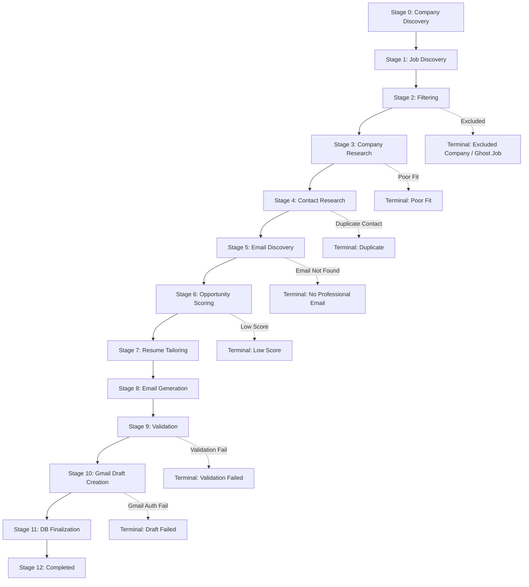
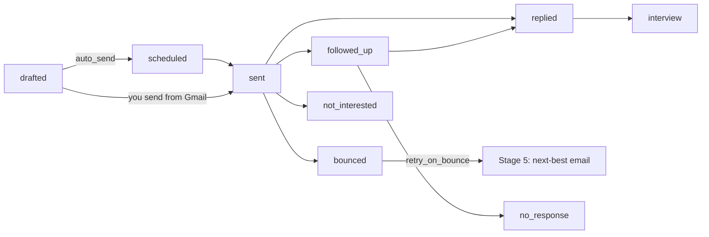

# Recruiting Platform Architecture & Design

This document details the production-grade architecture of the cold-email recruiting platform. It outlines the codebase layout, state machine transitions, SQLite database schemas, and integration points.

## System Architecture Overview

The system is designed with modularity, extensibility, and stateful resiliency as core tenets. It models the recruiting pipeline as a sequence of discrete, resumable stages.



## Directory Structure

The project conforms to a clean, package-centric Python structure:

```text
├── config.yaml          # System-wide configuration
├── Makefile             # Developers task runner
├── pyproject.toml       # Package dependencies & tool configs (Ruff/Mypy/Hatch)
├── README.md            # Quickstart documentation
├── resumes/
│   ├── resume_example.typ           # Example/template Typst resume (committed)
│   ├── resume_<your_name>.typ       # Your actual resume (git-ignored, local only)
│   └── generated/                   # Tailored Typst/PDF resumes
├── data/
│   └── platform.db      # SQLite database file
├── logs/
│   └── platform.log     # Structured pipeline execution logs
├── src/
│   ├── cli.py           # Typer CLI (campaign, discover, outreach, funnel, daemon, doctor, ...)
│   ├── config.py        # Pydantic configuration (all new sections optional with defaults)
│   ├── scheduler.py     # Daemon loop + Windows Task Scheduler / systemd installers + automation failsafe
│   ├── web_server.py    # REST API (status, funnel, campaigns, companies, contacts) & dashboard
│   ├── static/          # Dashboard frontend (index.html)
│   ├── db/
│   │   ├── models.py    # SQLAlchemy models (companies, jobs, contacts, applications, emails, campaigns, outreach_events, ...)
│   │   └── session.py   # Engine/session factory + automatic column migration
│   ├── pipeline/
│   │   ├── runner.py    # Orchestrator: run, targeted, campaigns, discover-only, outreach cycle, daily
│   │   ├── stages.py    # Stage 0-11 implementations
│   │   ├── campaign.py  # Natural-language goal parsing & campaign progress
│   │   └── schemas.py   # Pydantic schemas for structured LLM output
│   ├── sources/
│   │   ├── companies.py # Company discovery: LLM, list articles, YC directory, LinkedIn jobs, Wellfound, ATS boards
│   │   ├── ats.py       # Greenhouse / Lever / Ashby / Workable / SmartRecruiters board APIs + detection
│   │   ├── job_boards.py# LinkedIn guest jobs API, Wellfound & Indeed via search results
│   │   ├── contacts.py  # Contact discovery (LinkedIn search results, team pages, press, GitHub, Hunter, Apollo) & ranking
│   │   ├── emails.py    # Email finding + SMTP/catch-all/Hunter verification
│   │   └── enrichment.py# Hunter, Apollo and GitHub API clients
│   ├── intel/
│   │   ├── classify.py  # Sector, funding stage, role/persona, headcount & salary parsing
│   │   ├── scoring.py   # Company fit + rule-based opportunity scoring (hybrid with LLM)
│   │   └── learning.py  # Reply/interview outcome learning & response-probability estimates
│   ├── outreach/
│   │   ├── personas.py  # Persona guidelines, tones, follow-up prompt & templates
│   │   ├── scheduling.py# Send windows (timezone-aware)
│   │   └── engine.py    # Send due, threaded follow-ups, reply/bounce/OOO detection, stop-on-reply
│   ├── analytics/
│   │   └── funnel.py    # Conversion funnel, verification stats, outcome breakdowns
│   ├── providers/
│   │   ├── browser.py   # HTTP / Playwright fetching, JSON APIs, DuckDuckGo/Yahoo/Serper/Brave search
│   │   ├── gmail.py     # Gmail drafts, send, threads, scopes
│   │   └── llm/         # Groq (default), OpenAI, Anthropic, Gemini, local AGY
│   └── utils/
│       ├── email_verifier.py # Syntax/MX, patterns & inference, SMTP RCPT probe, catch-all detection
│       ├── resume.py    # Resume variant selection, highlight ranking, Typst text extraction
│       ├── caching.py   # SQLite-backed key-value caching with TTL
│       └── logging.py   # Structured logging utility (Console Rich + File JSON)
└── tests/               # 79 tests: pipeline, campaigns, Groq provider, sources, email finding, outreach engine, intel
```

## Database Schema (SQLite)

The database schema utilizes normalized tables to maintain data integrity and track state:

| Table Name | Key Columns | Description |
| :--- | :--- | :--- |
| **`runs`** | `id`, `status` | Every pipeline session. |
| **`campaigns`** | `goal`, `spec` (JSON), `target_companies`, `personas`, `auto_send`, `status` | Natural-language outreach goals driven across days. |
| **`companies`** | `name`, `domain`, `sector`, `sub_sectors`, `funding_stage`, `employee_count`, `hiring_status`, `tech_stack`, `recent_news`, `fit_score`, `response_probability`, `status`, `email_pattern`, `is_catch_all`, `ats_provider/token`, `source`, `campaign_id` | Company intelligence, fit and lifecycle (candidate → target/rejected → contacted). |
| **`jobs`** | `company_id`, `title`, `url`, `source`, `description`, `experience_years_required` | Postings from ATS boards, LinkedIn, careers pages, Wellfound, Indeed or speculative. |
| **`contacts`** | `company_id`, `name`, `role`, `role_category`, `source`, `linkedin_url`, `background`, `rank_score`, `email`, `email_status`, `email_confidence`, `rejected_emails`, `do_not_contact` | Every person found, classified and ranked. |
| **`applications`** | `job_id`, `contact_id`, `current_stage`, `state`, `score`, `score_breakdown`, `persona`, `campaign_id`, `outreach_status`, `sent_at`, `replied_at`, `interview_at`, `reply_category`, `response_probability` | Pipeline state + outreach outcome per company thread. |
| **`emails`** | `application_id`, `sequence_step` (0 = initial, 1..n = follow-ups), `status`, `gmail_draft_id`, `gmail_thread_id`, `rfc_message_id`, `scheduled_at`, `sent_at`, `tone`, `persona` | The full email sequence per application. |
| **`outreach_events`** | `application_id`, `event_type`, `gmail_message_id`, `details` | Timeline: drafted, sent, follow-up sent, reply, auto_reply, bounce, cancelled, duplicate_blocked. |
| **`resume_versions`** | `application_id`, `variant`, `highlights_order`, `path`, `keywords_added`, `reasoning` | Resume variant and tailoring per application. |
| **`history`** | `application_id`, `stage`, `state`, `run_id` | Stage transition audit log. |
| **`cache_entries`** | `key`, `value`, `expires_at` | Search/LLM/discovery cache. |

New columns are added to existing databases automatically on startup (`auto_migrate`).

## Outreach Lifecycle



The outreach engine (`outreach` command, `daemon`, or scheduled task) runs: sync manual sends → check replies
(human / auto-reply / bounce, LLM-classified) → send due emails in the send window → draft/send due follow-ups as
threaded replies (never after a reply) → close silent sequences.

## Resumability & Error Recovery

If a pipeline run crashes due to API limits, network timeouts, or OAuth token expirations, the state is persisted in `applications` and `history`.
- Calling `make resume` queries the database for active applications (`state` not in terminal list) and executes them starting precisely from their recorded `current_stage`.
- Calling `make retry` identifies applications currently flagged with recoverable failures (`Research Failed`, `Draft Failed`, `Validation Failed`), resets their stage counter back to the preceding operational stage, and resumes processing.
- The `NO DUPLICATES` check automatically flags redundant target contacts or already-emailed companies as `Duplicate` and bypasses Stage 5-10.